# DifFace: Blind Face Restoration with Diffused Error Contraction (TPAMI, 2024)

[Zongsheng Yue](https://zsyoaoa.github.io/), [Chen Change Loy](https://www.mmlab-ntu.com/person/ccloy/) 

[Paper](https://arxiv.org/abs/2212.06512)

<a href="https://colab.research.google.com/drive/1BNtoPPRuJwNDvqfwDOOmD9XJyF05Zh4m?usp=sharing"></a> [](https://huggingface.co/spaces/OAOA/DifFace)  


:star: If DifFace is helpful to your images or projects, please help star this repo. Thanks! :hugs: 

## Update
- **2023.12.11**: Add the code for image inpainting.
- **2022.12.19**: Add Colab demo <a href="https://colab.research.google.com/drive/1BNtoPPRuJwNDvqfwDOOmD9XJyF05Zh4m?usp=sharing"></a>. 
- **2022.12.17**: Add the [](https://huggingface.co/spaces/OAOA/DifFace).
- **2022.12.13**: Create this repo.

## Applications
### :point_right: Old Photo Enhancement
[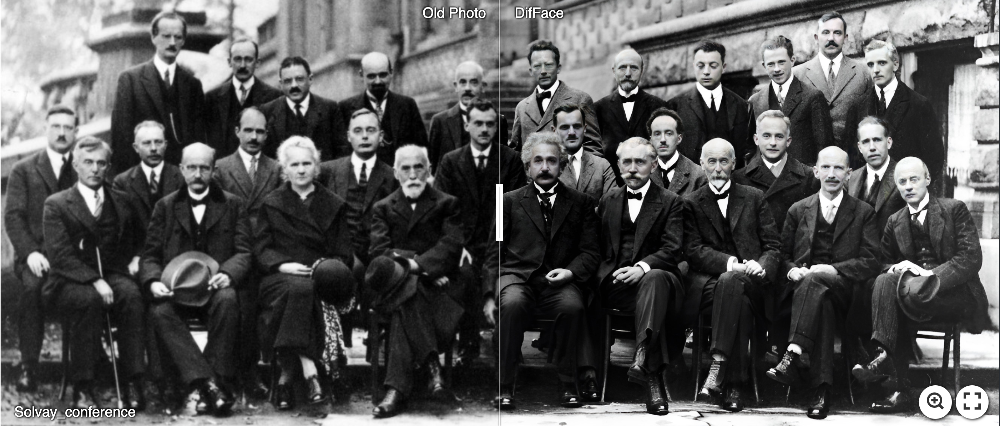](https://imgsli.com/MTM5NTgw)

[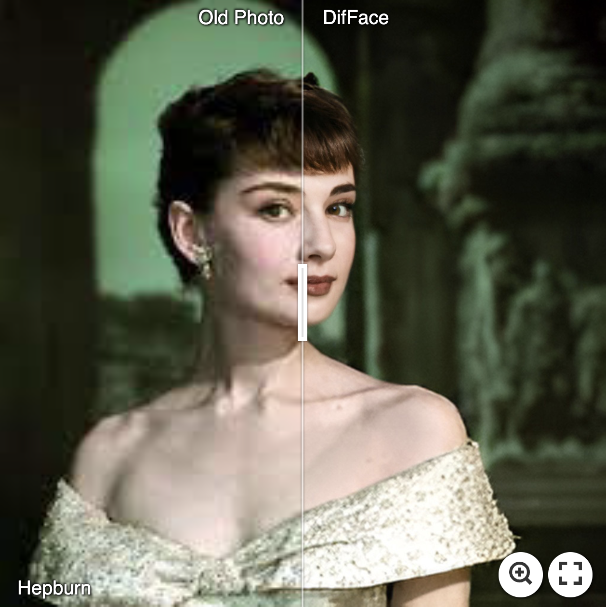](https://imgsli.com/MTM5NTc5) [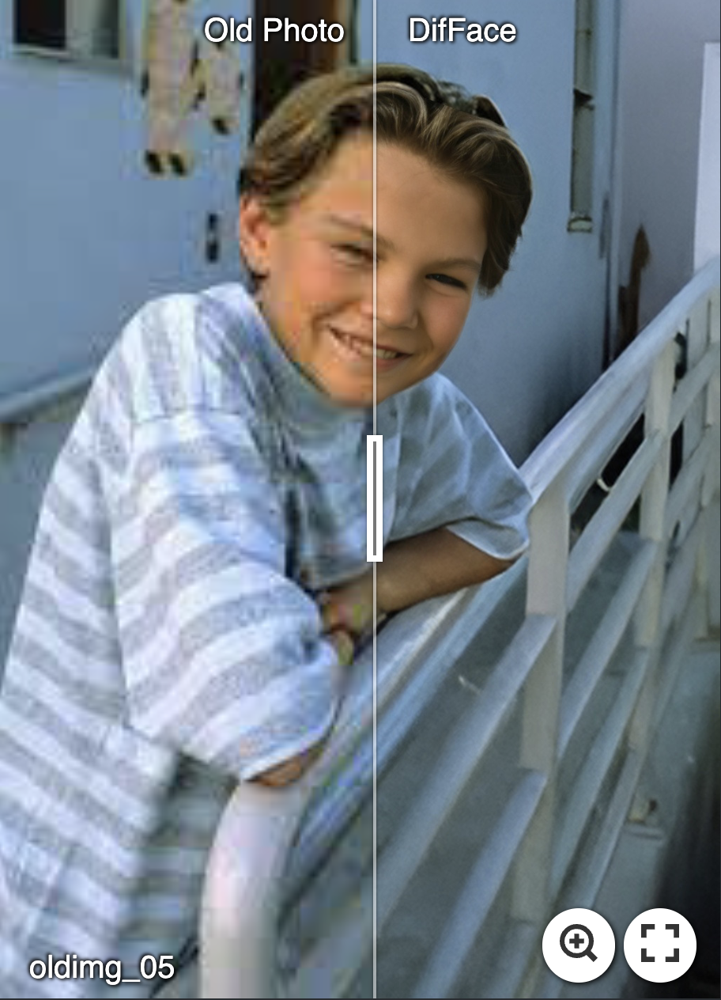](https://imgsli.com/MTM5NTgy)

### :point_right: Face Restoration
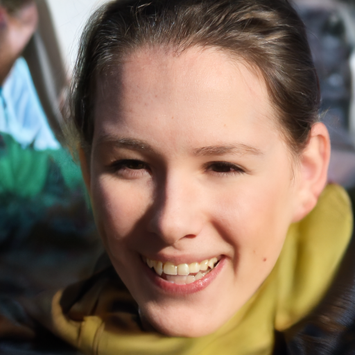 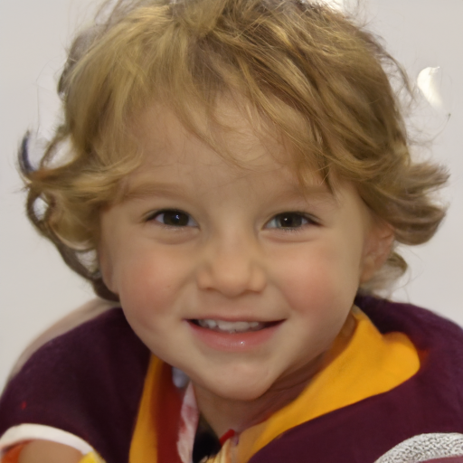
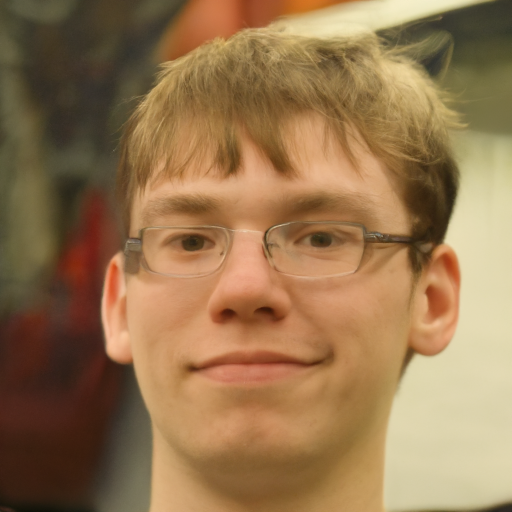 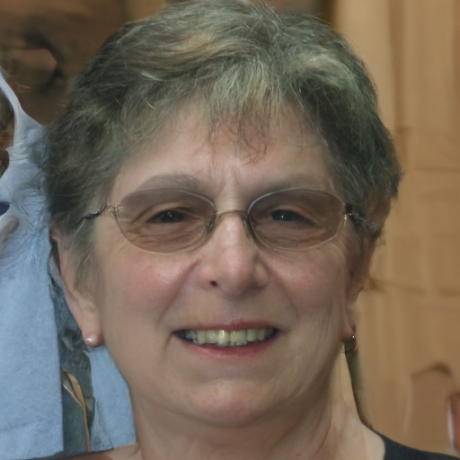

### :point_right: Face Inpainting
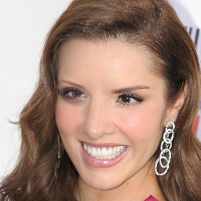 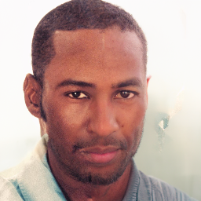
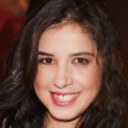 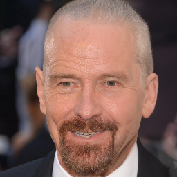

## Requirements
A suitable [conda](https://conda.io/) environment named `DifFace` can be created and activated with:

```
conda env create -f environment.yaml
conda activate DifFace
```

## Inference
#### :boy: Face image restoration (cropped and aligned)
```
python inference_difface.py -i [image folder/image path] -o [result folder] --task restoration --eta 0.5 --aligned --use_fp16
```
Note that the hyper-parameter eta controls the fidelity-realness trade-off, you can freely adjust it between 0.0 and 1.0. 
#### :cop: Whole image enhancement
```
python inference_difface.py -i [image folder/image path] -o [result folder] --task restoration --eta 0.5 --use_fp16
```
#### :princess: Face image inpainting
```
python inference_difface.py -i [image folder/image path] -o [result folder] --task inpainting --use_fp16
```
We assume that the masked area is filled with zeros in the low quality image. Based on such an assumption, the image mask is automatically deteced in our code.

## Testing
To reproduce the results in our paper, please follow the following guidelines to prepare the testing data.
1. Download the [FFHQ](https://github.com/NVlabs/ffhq-dataset) dataset, and resize them into size 512x512(or 256x256).
```
python scripts/big2small_face.py -i [Face folder(1024x1024)] -o [Saving folder(512x512)] --pch_size 512 
```
2. Make the testing dataset for restoration
```
python scripts/prepare_testing_restoration.py -i [CelebA folder(512x512)] -o [Saving folder]  
```
3. Make the testing dataset for inpainting
```
python scripts/prepare_testing_inpainting.py -i [CelebA folder(256x256)] -o [Saving folder]  
```

## Training
#### :turtle: Configuration

1. Modify the data path in data.train and data.val according to your own settings. 
2. Adjust the batch size based on your GPU devices.
    * train.batchsize: [A, B]    # A denotes the batch size for training,  B denotes the batch size for validation
    * train.microbatch: C        # C denotes the batch size on each GPU, A = C * num_gpus * num_grad_accumulation
#### :dolphin: Train diffusion model with 8 GPUS
```
torchrun --standalone --nproc_per_node=8 --nnodes=1 main.py --cfg_path configs/training/diffsuion_ffhq512.yaml --save_dir [Logging Folder]  
```
#### :whale: Train diffused estimator for restoration (SwinIR) with 4 GPUS
```
torchrun --standalone --nproc_per_node=4 --nnodes=1 main.py --cfg_path configs/training/swinir_ffhq512.yaml --save_dir [Logging Folder]  
```
#### :sheep: Train diffused estimator for restoration (LaMa) with 4 GPUS
```
torchrun --standalone --nproc_per_node=4 --nnodes=1 main.py --cfg_path configs/training/estimator_lama_inpainting.yaml --save_dir [Logging Folder]  
```

## License

This project is licensed under <a rel="license" href="https://github.com/sczhou/CodeFormer/blob/master/LICENSE">NTU S-Lab License 1.0</a>. Redistribution and use should follow this license.

## Acknowledgement

This project is based on [Improved Diffusion Model](https://github.com/openai/improved-diffusion).  Some codes are brought from [BasicSR](https://github.com/XPixelGroup/BasicSR), [YOLOv5-face](https://github.com/deepcam-cn/yolov5-face), and [FaceXLib](https://github.com/xinntao/facexlib). We also adopt [Real-ESRGAN](https://github.com/xinntao/Real-ESRGAN) to support background image enhancement. Thanks for their awesome works.

### Contact
If you have any questions, please feel free to contact me via `zsyzam@gmail.com`.
